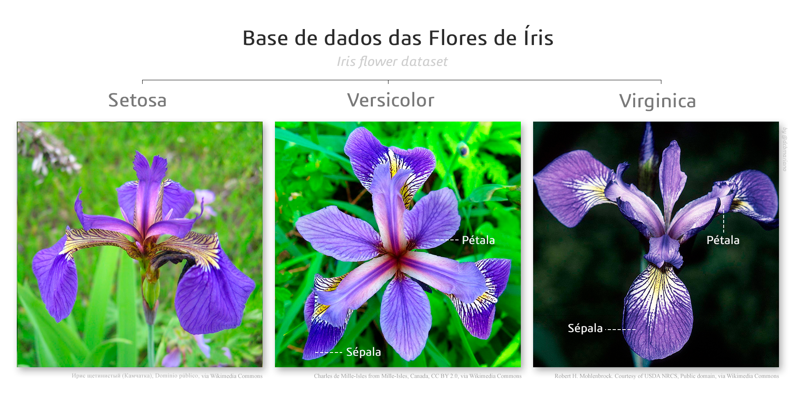
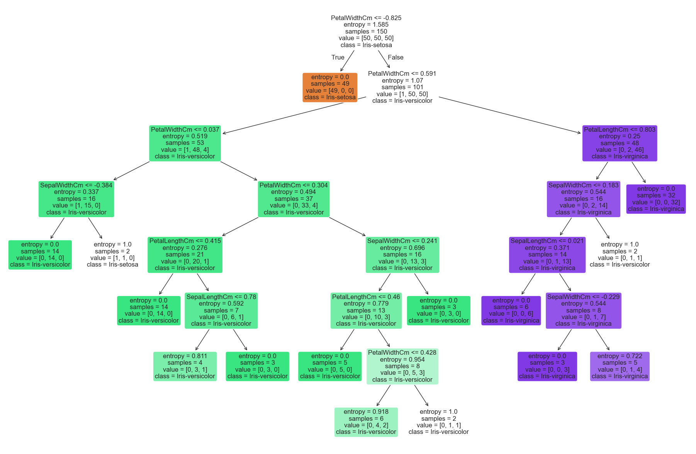
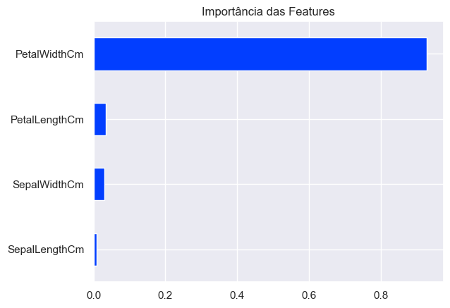

# 🌸 Classificação de Espécies Iris - Machine Learning

Este repositório contém um projeto completo de Ciência de Dados aplicado ao clássico [Iris Species Dataset](https://www.kaggle.com/datasets/uciml/iris/data). O objetivo principal foi explorar as características morfológicas das flores e desenvolver, avaliar e comparar múltiplos modelos de aprendizado de máquina para classificar as espécies com precisão.


Fonte: Por Diego Mariano - Obra do próprio, CC BY-SA 4.0, https://commons.wikimedia.org/w/index.php?curid=114511020

## 📊 Visão Geral do Projeto

O projeto está estruturado em etapas claras que cobrem desde a análise estatística inicial até a implementação e avaliação rigorosa de diversos algoritmos de classificação (*Decision Trees*, *Ensembles* e *Modelos Lineares*). Foram analisadas três espécies: *Iris-setosa*, *Iris-versicolor* e *Iris-virginica*.

### 📂 Estrutura dos Notebooks
Para facilitar a leitura e o acompanhamento do raciocínio analítico, o projeto foi dividido nos seguintes notebooks:
* **`01_gd_eda.ipynb`**: Análise Exploratória de Dados (EDA). Limpeza, estatística descritiva e visualizações para entender a distribuição e as correlações das variáveis.
* **`02_gd_modelos_parte_01_*.ipynb`**: Implementação e otimização individual dos modelos testados (Logistic Regression, Decision Tree, Random Forest, XGBoost e LightGBM).
* **`02_gd_comparacao_.ipynb`**: Avaliação de performance cruzada e comparação de métricas, permitindo selecionar o melhor modelo para o problema.

## 📈 Análise Exploratória (EDA)
Principais descobertas durante a fase de exploração:
* **Balanceamento:** O conjunto de dados é perfeitamente balanceado, com 50 amostras para cada classe.
* **Separação Linear:** A espécie *Iris-setosa* apresenta características únicas, tornando-se facilmente separável das demais.
* **Correlações:** Existe uma forte correlação positiva entre o comprimento e a largura das pétalas.

## ⚙️ Modelagem e Resultados

A metodologia seguiu rigorosas práticas de validação para evitar vazamento de dados (*data leakage*) e garantir a generalização do modelo, utilizando *Pipelines* e validação cruzada estratificada (`StratifiedKFold`).

### Modelos Testados
* Regressão Logística (Logistic Regression)
* Árvore de Decisão (Decision Tree)
* Random Forest
* XGBoost
* LightGBM (LGBM)

### 🏆 Conclusões Finais e Modelo Vencedor

Após o treinamento e a comparação empírica de todos os algoritmos, o modelo de **Árvore de Decisão (Decision Tree)** apresentou o melhor desempenho geral, alcançando **96% de acurácia**.

Além do excelente desempenho métrico, a Árvore de Decisão ofereceu uma interpretabilidade essencial para o negócio. A análise de importância das variáveis (*Feature Importance*) revelou que:
* A variável **`PetalWidthCm` (Largura da Pétala)** foi a característica com a maior importância preditiva no modelo vencedor, atuando como o principal nó de decisão para a separação correta das espécies.

<div align="center">




</div>


## 🛠️ Tecnologias Utilizadas
* **Linguagem:** Python
* **Manipulação de Dados:** Pandas, NumPy
* **Visualização:** Matplotlib, Seaborn
* **Machine Learning:** Scikit-Learn, XGBoost, LightGBM


## Organização do projeto

```
├── .gitignore         <- Arquivos e diretórios a serem ignorados pelo Git
├── IrisSpecies.yml       <- O arquivo de requisitos para reproduzir o ambiente de análise
├── LICENSE            <- Licença de código aberto se uma for escolhida
├── README.md          <- README principal para desenvolvedores que usam este projeto.
├── notebooks          <- Cadernos Jupyter.
│
|   └──src             <- Código-fonte para uso neste projeto.
|      │
|      ├── __init__.py  <- Torna um módulo Python
|      ├── config.py    <- Configurações básicas do projeto
|      ├── models.py    <- Scripts para criar e treinar os modelos
|      └── graficos.py  <- Scripts para criar visualizações exploratórias e orientadas a resultados
|
└── referencias        <- Dicionários de dados, manuais e todos os outros materiais explicativos.

```

## 🚀 Como Reproduzir este Projeto

Para garantir que o código funcione exatamente como na máquina em que foi desenvolvido, as dependências foram isoladas. Siga os passos abaixo para recriar o ambiente virtual utilizando o `conda`:

1. **Clone o repositório:**
   ```bash
   git clone https://github.com/djgabriel93/Iris_Species.git
   cd Iris_Species

2. **Crie o ambiente virtual a partir do arquivo YML:**
   ```bash
    conda env create -f IrisSPecies.yml

3. **Ative o ambiente criado:**
   ```bash
    conda activate IrisSPecies

4. **Inicie o Jupyter Notebook ou Lab:**
   ```bash
    jupyter notebook

---
*Projeto desenvolvido por Gabriel Duarte.*

---
